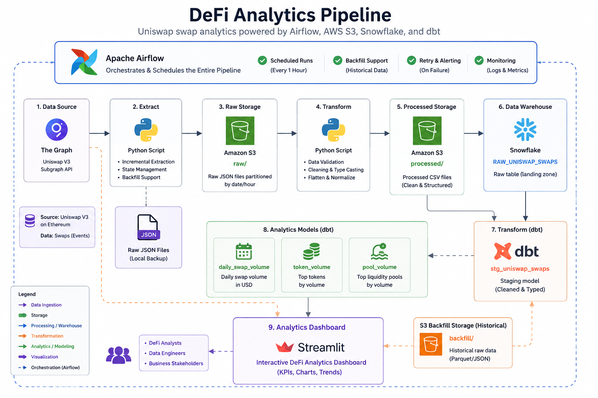
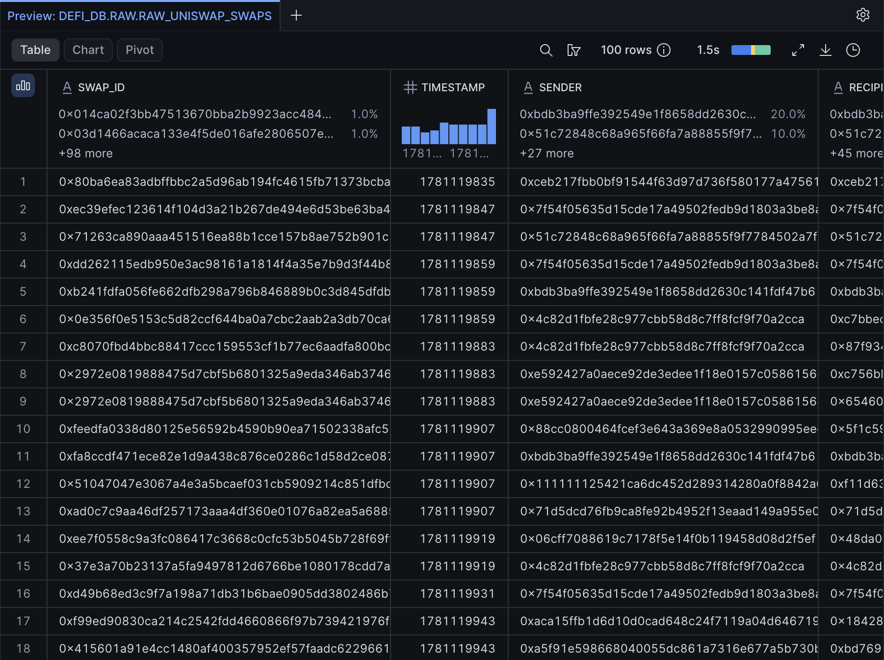
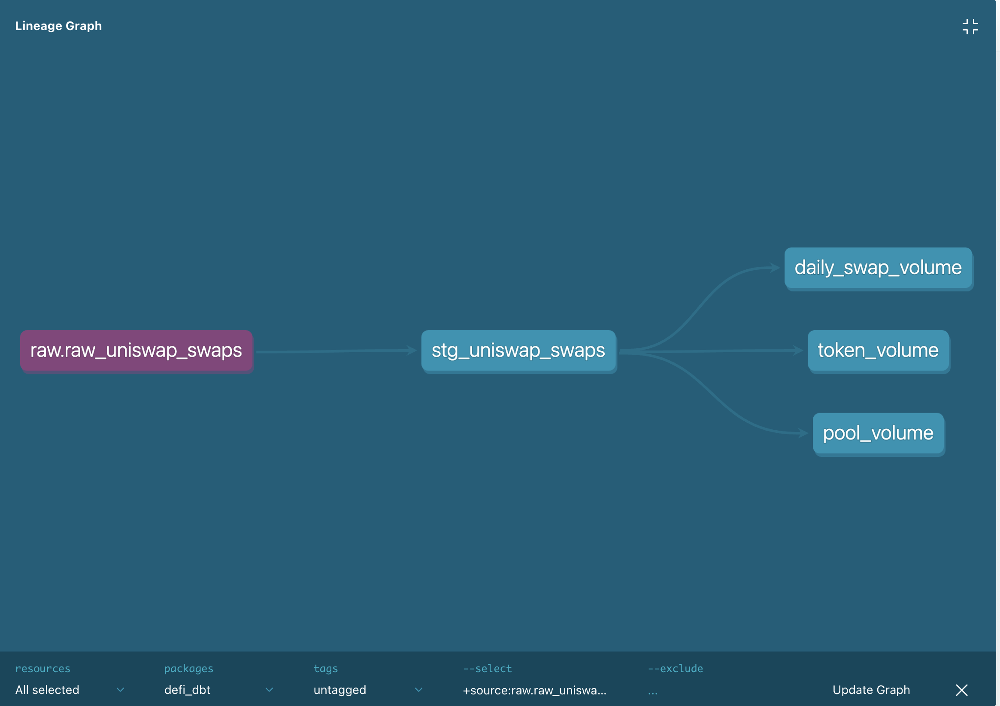
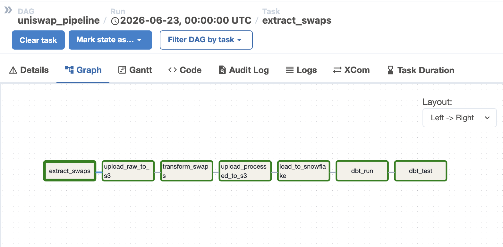
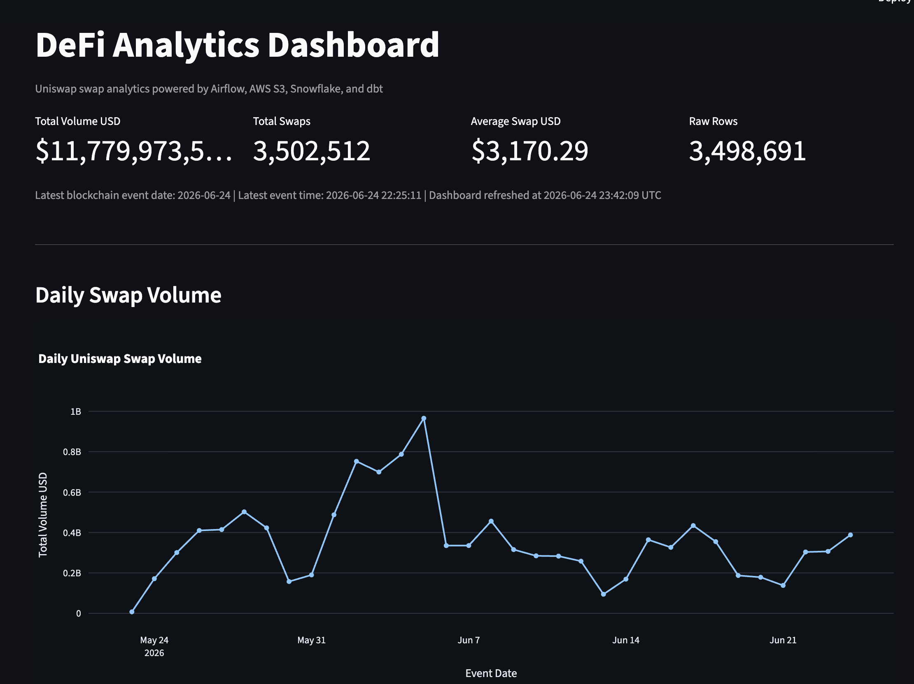
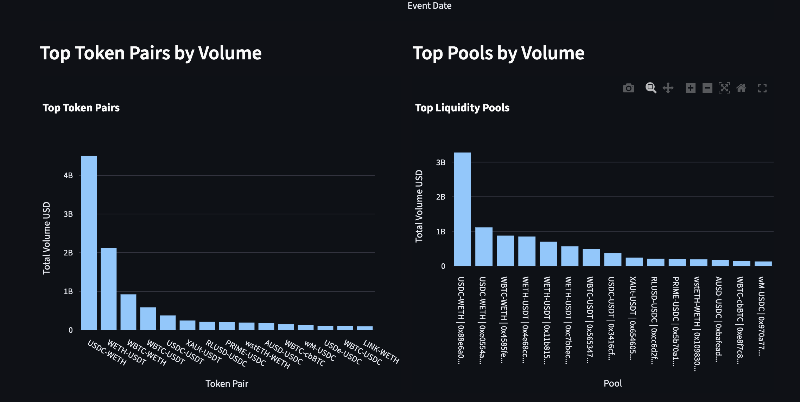
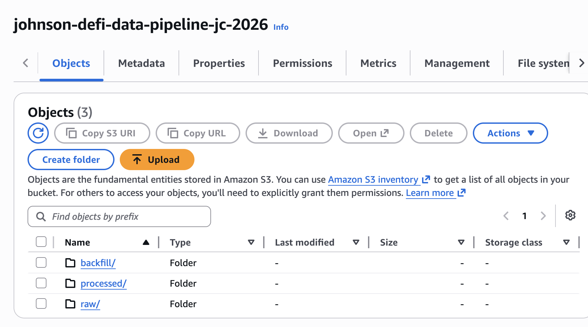

# DeFi Data Pipeline

An end-to-end Data Engineering project that builds a production-style ELT pipeline for Uniswap V3 blockchain data. The pipeline incrementally extracts swap events from The Graph API, stores raw and processed data in Amazon S3, loads data into Snowflake, transforms it with dbt, and visualizes analytics through a Streamlit dashboard.

The project demonstrates modern data engineering practices including workflow orchestration with Apache Airflow, incremental data processing, cloud data warehousing, automated data quality testing, and dashboard reporting.

---

## Architecture



```text
The Graph API
      ↓
Apache Airflow
      ↓
AWS S3 (Raw Data Lake)
      ↓
Snowflake RAW Layer
      ↓
dbt Staging Layer
      ↓
dbt Incremental Mart Layer
      ↓
Analytics & Reporting
```

---

## Tech Stack

### Data Ingestion
- Python
- The Graph API

### Orchestration
- Apache Airflow

### Storage
- AWS S3
- Snowflake

### Transformation
- dbt

### Infrastructure
- Docker
- Docker Compose

### Security
- RSA Key-Pair Authentication
- Snowflake Roles & Service Accounts

### Development
- Git
- GitHub
- uv

---

## Project Objectives

- Build a production-style ELT pipeline
- Automate blockchain data ingestion
- Store raw and transformed data separately
- Implement scalable data modeling practices
- Validate data quality automatically
- Demonstrate modern cloud data engineering workflows

---

## Data Flow

### 1. Extract

Airflow triggers a Python extraction script that retrieves swap events from the Uniswap protocol through The Graph API.

Output:

```text
Raw swap data
```

---

### 2. Load Raw Data to S3

Raw files are stored in AWS S3.

Purpose:

- Data lake storage
- Historical backup
- Reprocessing capability

Output:

```text
s3://...
```

---

### 3. Transform

Python transformation scripts:

- Clean records
- Standardize fields
- Generate analytics-ready datasets

Output:

```text
uniswap_swaps_processed.csv
```

---

### 4. Load to Snowflake

Processed data is loaded into:

```sql
DEFI_DB.RAW.RAW_UNISWAP_SWAPS
```

using Snowflake RSA key authentication.

---

### 5. dbt Transformation Layer

dbt transforms raw data into analytics-ready models.

#### Staging Layer

```text
STG_UNISWAP_SWAPS
```

Responsibilities:

- Standardize schema
- Rename fields
- Apply data type conversions
- Create reusable models

---

#### Mart Layer

##### DAILY_SWAP_VOLUME

Daily aggregated swap volume metrics.

##### TOKEN_VOLUME

Token pair trading volume analytics.

##### POOL_VOLUME

Liquidity pool volume analytics.

---

## Incremental Processing

The mart models are implemented using dbt incremental materializations.

Benefits:

- Process only new data
- Reduce Snowflake compute costs
- Improve pipeline performance
- Scale efficiently with data growth

Example:

```sql

    WHERE event_date >= (
        SELECT COALESCE(MAX(event_date), '1900-01-01')
        FROM {{ this }}
    )

```

---

## Snowflake Raw Data



---

## Data Quality Testing

Implemented using dbt tests.

Current validations:

### STG_UNISWAP_SWAPS

- swap_id is unique
- swap_id is not null
- amount_usd is not null

### DAILY_SWAP_VOLUME

- event_date is unique
- event_date is not null

Run tests:

```bash
uv run dbt test
```

---

## dbt Lineage



---

## Security

Snowflake access is secured through:

### Service Account

```text
DBT_USER
```

### Role-Based Access Control

```text
DBT_ROLE
```

### RSA Authentication

- Private key authentication
- No password-based access
- Automated Airflow execution

This follows the principle of least privilege commonly used in production environments.

---

## Airflow Workflow

```text
extract_swaps
        ↓
upload_raw_to_s3
        ↓
transform_swaps
        ↓
load_to_snowflake
        ↓
dbt_run
        ↓
dbt_test
```

---

### Airflow Pipeline



The Airflow DAG orchestrates the complete ELT workflow, including incremental extraction, S3 uploads, data transformation, Snowflake loading, dbt model execution, and automated data quality testing.

---

## Running the Project

### Start Infrastructure

```bash
docker compose up -d
```

### Run Airflow

```bash
docker compose -f docker-compose-airflow.yml up -d
```

### Run dbt

```bash
cd defi_dbt

uv run dbt run
uv run dbt test
```

### Launch Dashboard

```bash
uv run streamlit run dashboard/app.py
```

---

## Streamlit Dashboard

### Overview



### Analytics



---

## Amazon S3 Data Lake

Raw, processed, and historical backfill datasets are stored separately to support incremental ingestion, analytics, and recovery.



---

## Future Enhancements

- Load data directly from Amazon S3 into Snowflake using COPY INTO
- Store processed datasets in Apache Parquet format
- Add CI/CD pipeline with GitHub Actions
- Deploy Streamlit dashboard to the cloud
- Integrate data quality monitoring and alerting
- Support additional DeFi protocols beyond Uniswap V3
- Implement real-time streaming ingestion with Kafka
- Deploy pipeline components on Kubernetes

---

## Author

Chung-Sheng (Johnson) Chang

Built as a hands-on Data Engineering project to demonstrate modern cloud data platform design, orchestration, modeling, testing, and automation practices.